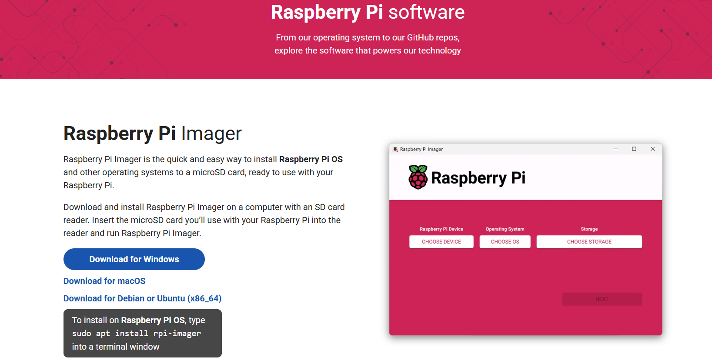
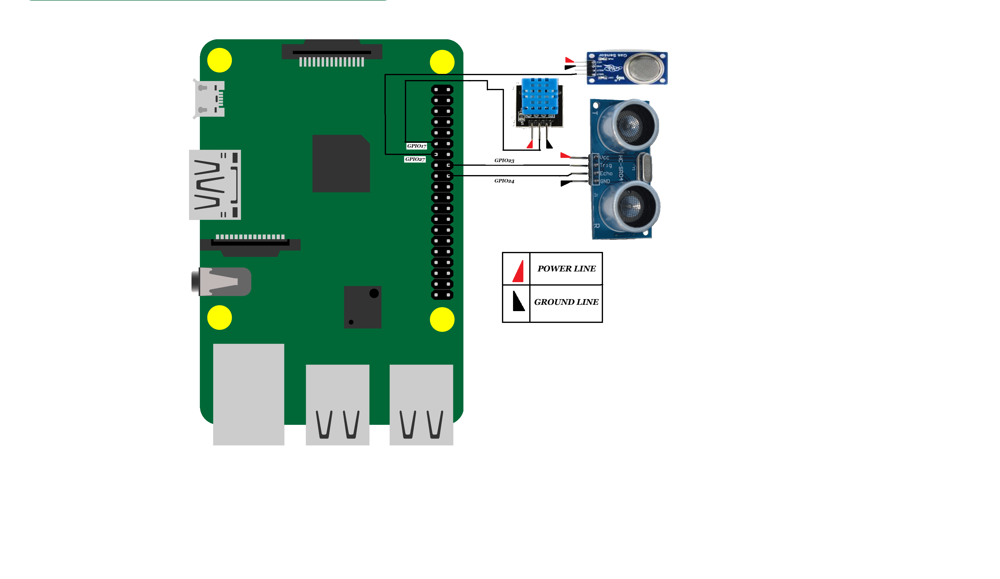

# Realtime-fault-detection-edgeML
Real-time multi-label fault detection system using XGBoost on Raspberry Pi. Processes multi-sensor data to identify gas leaks, temperature overshoot, and tank leaks simultaneously. Enables efficient, low-latency fault monitoring for industrial IoT and edge computing applications.

# About setting up RPi for the deployment 
1. [Link for downloading RPi OS](https://www.raspberrypi.com/software/operating-systems/)

2. Insert SD card into your computer through card reader while opening the Installer, it will directly be downloaded into your SD card

3. Once downloaded the Download Geany editor, I find this the more convienent feel free to download any editor of your choice and run the code given in repo

# About the connections:)

***Connections, Power lines are 5V*.**
 

 # Setup Image.
 
***Believe me, you can do much better than this*.**